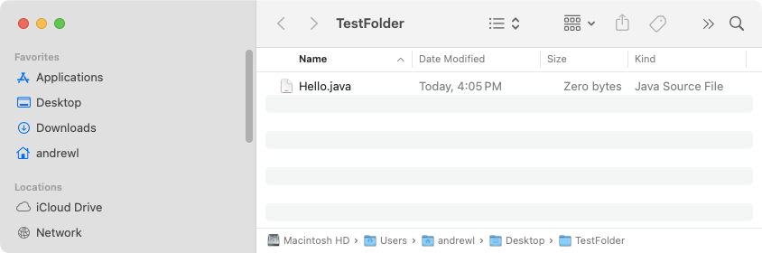
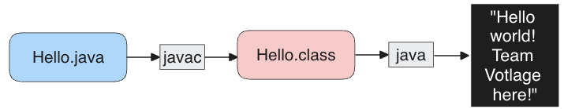

Here we'll play with compiling programs locally (on your computer) instead of letting websites like codecademy and leetcode run code for us.

First, install the java development kit (JDK) on your machine. The way to do this varies so wildly with different types of machines that you might have to do some internet searching first.

As always, grab a mentor if you get stuck.

## Make sure you can create, edit, and save files.

There are many programs that can create, edit, and save files. On windows, notepad is the most basic but works well enough.

Another common one is [Notepad++](https://notepad-plus-plus.org/) which you'll have to download and use.

Choose your editor, and create a folder on your desktop called `TestFolder`. Now, inside that folder, create a file called `Hello.java` using your text editor:



Now use your file browser to show what you did. On Windows it's called Explorer. On MacOS it's called finder. On Linux it can vary based on your distribution.

Your screen might not look exactly the same, but the principle is what's important. You need to be able to create folders and files.

Ask a mentor for help if you need it.

## Make sure your can compile and run java.

Navigate your shell to that folder using the `cd` command which stands for "change directory". The word "directory" is another name for folder in this context.

Change the contents of `Hello.java` to read:

```java
public class Hello
{
	public static void main(String args[])
	{
		System.out.println("Hello, world! Team Voltage here!");
	}
}
```

The command to compile java is `javac` which stands for "java compiler". You invoke it like this:

```
$ javac Hello.java
```

Now notice there's a new file created: `Hello.class`. Everything in java has to be contained in the programming concept called a class. Please refer to the [codecademy tutorial](../Codecademy-Course-Learn-Java/README.md) for more information.

Now let's run the program. When we tell java to execute this file containing the class, it will, by convention, look for a method named `main` which we have defined to print out our message:

```
$ java Hello
Hello, world! Team Voltage here!
```

Notice when we compile the program, we give it the entire name of the file (Hello.java) but when we tell java to execute the program, we only give it the class name (Hello). Java knows that to find the code for a class named "Hello", it must look for a file called "Hello.class".

This is confusing! Let's make a diagram of what's going on here!



## Let's experiment with JShell

There is a very powerful tool you need to learn called `jshell` which allows you to experiment with code in a flexible way instead of committing code to a file, saving it, compiling it (with `javac`) and running it (with `java`).

This also encourages you to develop a mentality necessary for programming: one of exploration and experimentation. You want to try and figure out as much as you can before searching for answers. It is tough at first, but little by little your intuition will grow and before you know it, you'll be guessing and verifying more often than you thought possible!

Alright, in your shell, run `jshell` by typing the command:

```
$ jshell
|  Welcome to JShell -- Version 21.0.1
|  For an introduction type: /help intro

jshell>
```

It will sit and listen for our commands. Let's see if we can create an array of `int`. Now I already forget the exact syntax, but I know it has brackets, square ones and curly ones. Let's see if I can get an array with the first 5 integers in it:

```
jshell> int [] myArray = 0, 1, 2, 3, 4
|  Error:
|  <identifier> expected
|  int [] myArray = 0, 1, 2, 3, 4;
|                     ^

jshell> int [] myArray = [0, 1, 2, 3, 4]
|  Error:
|  illegal start of expression
|  int [] myArray = [0, 1, 2, 3, 4];
|                   ^

jshell> int [] myArray = {0, 1, 2, 3, 4}
myArray ==> int[5] { 0, 1, 2, 3, 4 }
```

Ah! So it's curly brackets to hold the initial values of the array.

Ok, how do I get the 2nd element?

```We "dereference" it with the brackets, right?
jshell> myArray(2)
|  Error:
|  cannot find symbol
|    symbol:   method myArray(int)
|  myArray(2)
|  ^-----^
```

Try your best to read that error message. It says `method myArray`. But "myArray" is not the name of a method, it's the name of my array. For some reason java thinks I'm doing something with a method. Oh, it's because of the parenthesis. When you call a method, you use parentheses to send it arguments. So instead of `myArray(2)` we need `myArray[2]`:

```
jshell> myArray[2]
$4 ==> 2
```

That's better!

Hey, remember how we were able to print stuff in the "Hello World" example? Let's isolate that confusing line in here and experiment with it. We can see if it will print something else:

```
jshell> System.out.println("It works!")
It works!
```

## Final test!

Ok, to prove that you have this down, see if you can convert the [easy leetcode tutorial](../Leetcode-2Sum-Easy/README.md) into a local,  standalone version.

Create `Solution.java` with the following content:

```java
class Solution
{
    public int[] twoSum(int[] nums, int target)
    {
        int[] answer = new int[2];

        for(int i=0; i<nums.length; ++i)
        {
            for(int j=i+1; j<nums.length; ++j)
            {
                if (nums[i] + nums[j] == target)
                {
                    
                    answer[0] = i;
                    answer[1] = j;
                    return answer;
                }
            }
        }

        return answer;
    }
}
```

Now create `Driver.java` with the following content:

```java
import java.util.Arrays;

class Driver
{
	public static void main(String [] args)
	{
		int [] nums = {2, 7, 11, 15};
		int target = 9;

		Solution sol = new Solution();
		int [] result = sol.twoSum(nums, target);

		System.out.println("result: " + Arrays.toString(result));
	}
}
```

Compile both files into their respective class files:

```
$ javac Solution.java
$ javac Driver.java
```

Now run the driver:

```
$ java Driver
result: [0, 1]
```

Notice it prints 0, 1 because those are the indices that contain addends that sum to the target 9!

Also notice that, in a way, we're programming what leetcode has been doing when we hit "run" or "submit".
