In this tutorial, we'll install VSCode+WPILib, which is an app that tries to combine text editing (writing code) with compiling (translating) and running code. In other words, it's a single place where you can do all your programming.

## Step 1: Get it!

Head over to https://github.com/wpilibsuite/allwpilib/releases and download the latest version with 2024 in the name. You'll need to match the appropriate release with whatever platform you have. I am on a MacOS computer with an ARM M3 chip, so I choose:

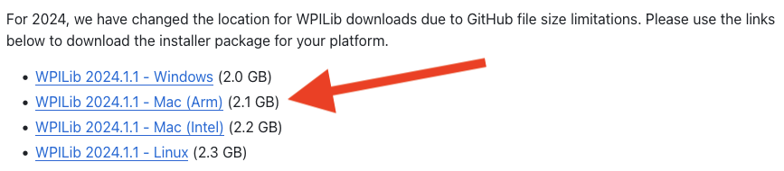

Ask a mentor for help if you need it.

Alternatively, if you're with the team, ask if a mentor has this software already on USB, as it's a large download and could save you a lot of time.

## Step 2: Install it!

Depending on your platform, you might have to mount a disk image or uncompress an archive.

Try double-clicking on the downloaded file, and from within there search for a file with the word "installer" in it, then execute that.

You should be guided through the installation process. Ask a mentor for help if you need it.

## Step 3: Getting Started

Now that it's installed, run it! This can be tricky if the installer did not place an obvious icon somewhere for you to click.

After an initial screen where you set your theme, you should have something like this:

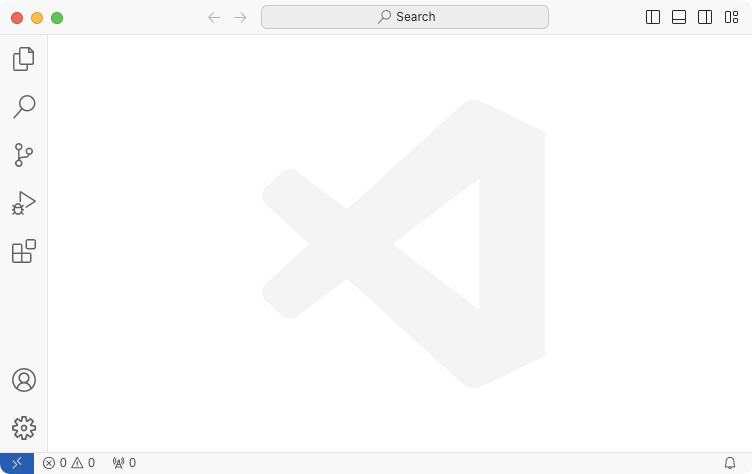

## Step 4: Create a Java Program

Navigate to menu File -> New File and then click "New Java File".

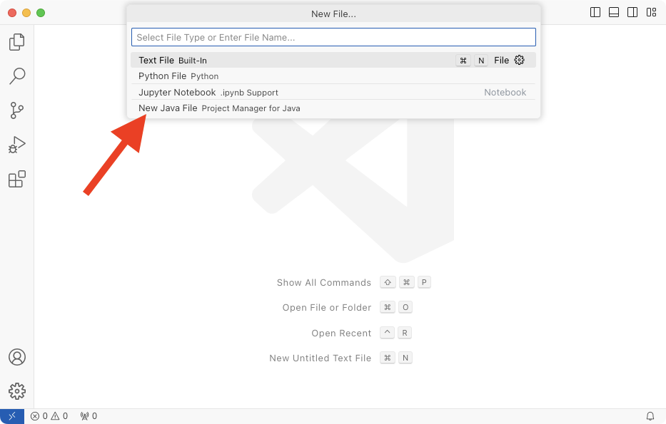

You might get a nag message in the bottom right about sending data to Red Hat, who made the Java extension that's running. Deny the request and move on. You should now see:

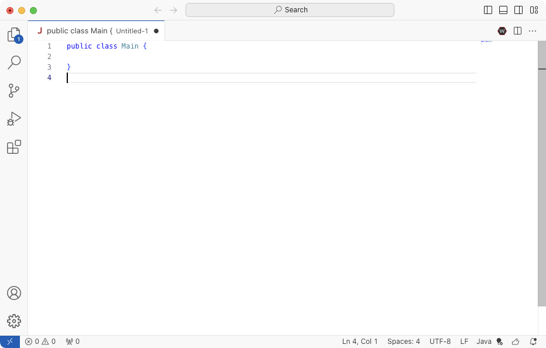

## Step 5: Write that program!

Alright, you know a little bit of Java. We're given a class called `Main` and by convention, if the class has a static method named `main`, it will be called when we execute that class file:

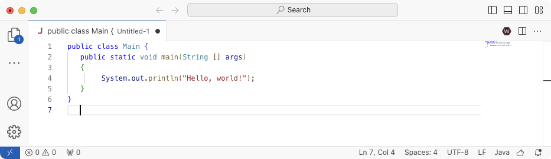

## Step 6: Run that program!

Now try to execute it. You can use the main menu Run -> Run Without Debugging. Since we haven't even saved this file to disk yet, we are prompted to do so. Since the file has class `Main`, we must, by Java convention, save it in a file named `Main.java`. I recommend you do this on your desktop in a folder called `FirstProject` to make it easy to find later:

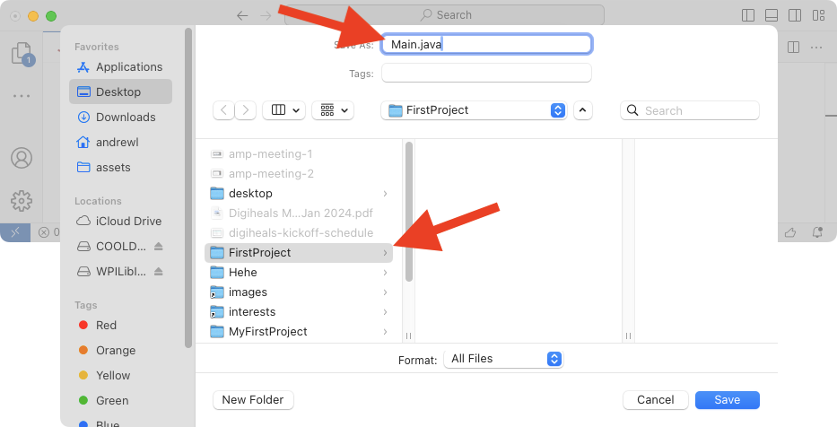

Another way is to click this icon in the top right:

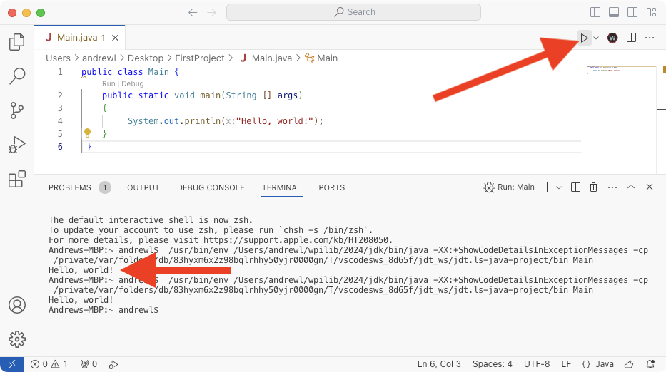

## Step 7: Introducing Projects

VSCode has this concept of a "Project" which I am not an expert in, but let's explore together.

Choose the "Explorer" icon:

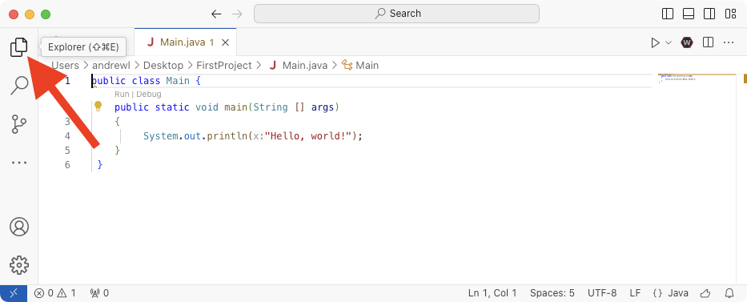

It says no folder is opened.

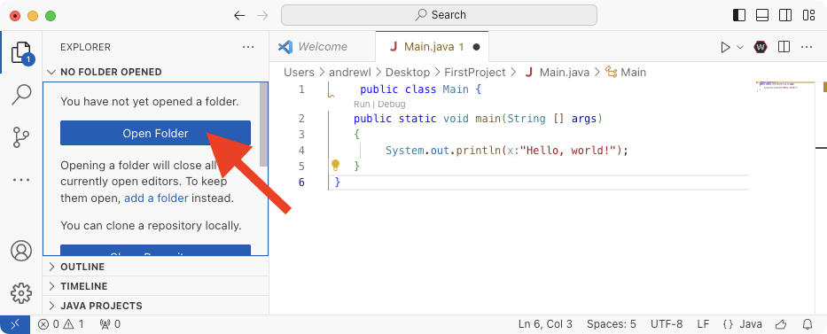

Let's point it to the FirstProject folder where we saved Main.java:

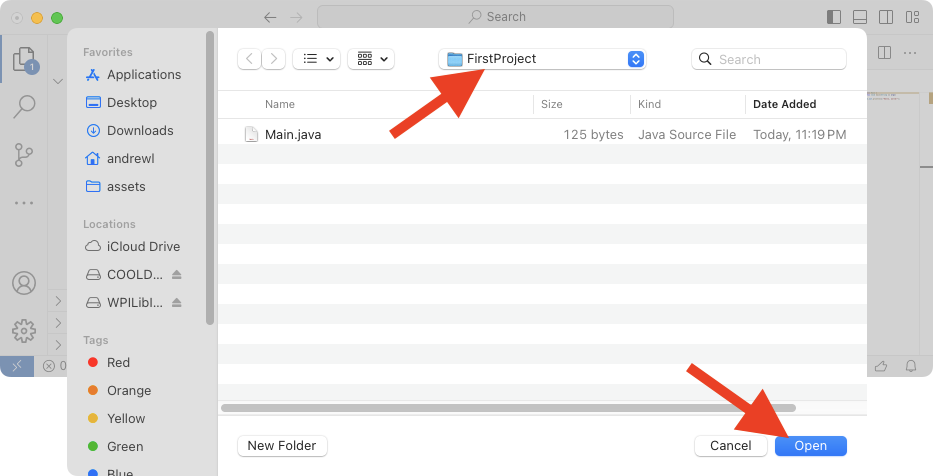

And now we have a cool environment with a file explorer in the left column, our source code in the top right, and our terminal showing the program's output in the bottom right:

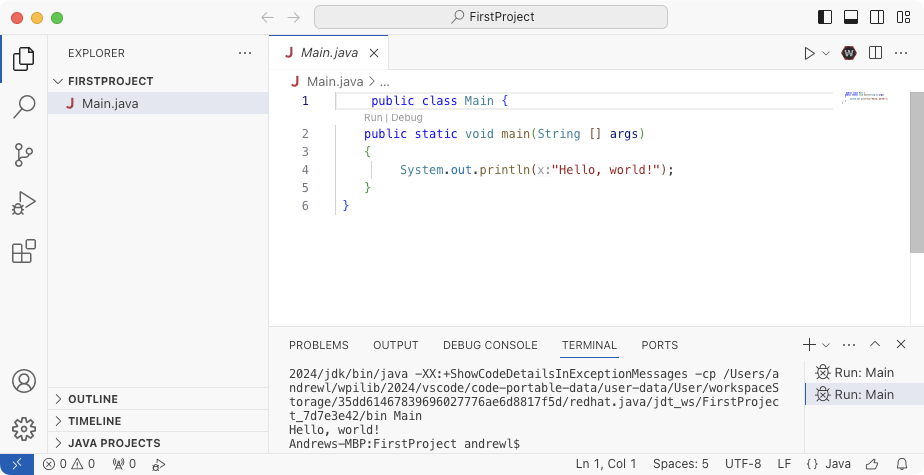

## Conclusion

You've now installed and used VSCode to do a very basic task: Write and run the famous "Hello, world!" starter program!
