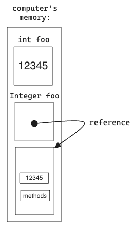
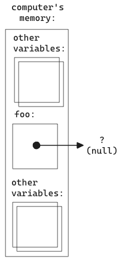
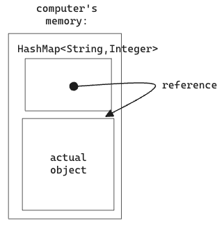

Let's learn about this fancy data structure called a `HashMap`.

This tutorial uses `JShell`, so if you haven't gotten that working yet, refer to [the compiling locally and using JShell tutorial](../Compile-Locally-And-Use-JShell).

## Step1: What is a HashMap?

It let's us make an association between one type of data called the key, with another type of data, called the value.

Sounds fancy, right? We'll let me give you some real-life examples and you'll see that the idea is pretty easy.

In your contacts, or in a phonebook, we want to look up someone's name and find their phone number. The name is the key, and the phone number is the value. The data type of the name could be a `String` and the data type of the value could be `int`.

If we were writing astronomy software, we may want to link up the planets with values like how long their day is, or their distance from the sun. In that case, every plant would be the key, and the value would be how long their day is.

The `HashMap` basically takes care of associating one data with another.

## Step2: How do we make one?

We declare it, just like any other variable, except the data type looks a little more complicated.

Like think of we declare an `int`. We simply type that data type "int" followed by the name of the variable, like this:

```javaj
shell> int foo;
foo ==> 0
```

We can actually get away with declaring a naked HashMap:

```
jshell> HashMap foo;
foo ==> null
```

But to have it be useful, we need to tell it what type of data it's associating, what type of data will be the key and what type will be the value. We put those type in angle brackets. For example, to associate `String`'s with `int`'s we'd do:

```
jshell> HashMap<String,int> foo;
|  Error:
|  unexpected type
|    required: reference
|    found:    int
|  HashMap<String,int> foo;
|                 ^-^
```

Oh no. Notice it says "required: reference". HashMap's can only associate objects with other objects. While `String` is an object (and notice it follows the capitalized convention), the type `int` is not, it's primitive. There is a class version of `int` however called `Integer`:

```
jshell> HashMap<String,Integer> foo;
foo ==> null
```

The difference between `int` and `Integer` is something that has to be explained. It's ok to skip it now and press on, but if you'd like more of an explanation, ask a mentor. In short, an `int` is like an integer as raw as it gets. Internally it's just 0's and 1's that represent that integer, like the number 12345. The class `Integer` however, is a beefed up way to store an int, and comes with behaviors (implemented via methods) like `parseInt()`.



And what's with that null stuff? Well objects are tracked inside your computer with what's called references. Really it's just the memory addresses where the object resides. When there is no memory address present, it points at nothing, and java uses the word "null" for that. So what we did is just make reference called foo, we didn't actually make the HashMap object itself.



So now let's actually reference (or point) that variable foo to an object:

```java
jshell> HashMap<String,Integer> foo = new HashMap<String,Integer>()
foo ==> {}
```

Wow that's a lot of typing isn't it? Note that when you make a class, it becomes a new data type. Like if you make a new class called `Person`, that means you can declare variable with type `Person` from then on. And we'd do it by calling the constructor with `... = new Person()`.

Here, the data type is `HashMap<String,Integer>` and that's why the right hand side of the above assignment is `... = new HashMap<String,Integer>()`. Remember, in Java, the constructor is conventionally named the exact same thing as the class.

Now what memory looks like this:



That's a lot of detail! Don't worry if you don't get it yet. I promise it will become clear as you get more experience. Ask a mentor!

## Step3: How do we use one?

Like all classes, you use the methods. A full list is here: https://docs.oracle.com/javase/8/docs/api/java/util/HashMap.html

This can be tough to read, but give it a shot, it will become more comprehensible over time. Right now just seek out useful methods.

The best method is `put()` which let's use insert key/value pairs into the HashMap:

```java
jshell> foo.put("John", 7)
$8 ==> null
```

Ah! There's null again. But that's just showing you that the `put()` method didn't return anything. It did its behavior _in place_, modifying the HashMap named `foo` instead of computing a value and returning it. Let's ask `jshell` what foo looks like now:

```
jshell> foo
foo ==> {John=7}
```

Yay! John is associated with the number 7! Could we get that with code? With the `get()` method!

```
jshell> foo.get("John")
$10 ==> 7
```


