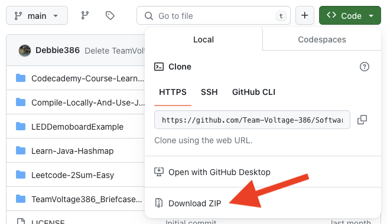
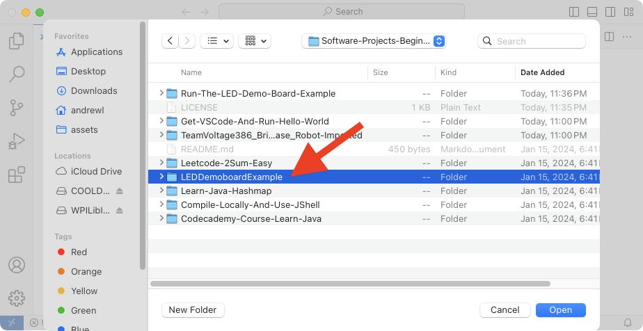
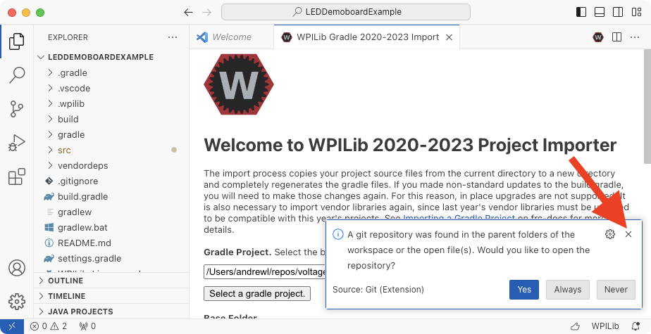

In the last tutorial, we installed VSCode+WPILib and ran "Hello, world!". In this tutorial, we're going to send something to the "briefcase bot", which is a RoboRio (the brain our robots use) and some peripherals, especially this strip of LED lights!

## Step 1: Get The Code!

Visit https://github.com/Team-Voltage-386/Software-Projects-Beginner and click "Code":

This will pop up a menu, from which you will choose "Download zip":

Now uncompress the downloaded file `Software-Projects-Beginner-main.zip`, perhaps to your Downloads folder.

Ask a mentor if you need help.

## Step 2: Open the project in VSCode!

Ok, run VSCode.

Now use menu File -> Open Folder and navigate to the `LEDDemoBoardExample` folder within the `Software-Projects-Beginner-main` folder decompressed from the github download:

Choose to trust the authors:

If prompted, choose to update the project with the current version of the extension:

Deny the nag request to manage the .git folder in the parent directory. IDE's can be so annoying:

Now navigate, using the filesystem explorer view on the left, to the source files:

## Step 3: Build The Project!

Hopefully you get this:

If not, ask a mentor for help.

## Step 4: Connect to the Briefcase Bot

Plug it in, give it a moment to broadcast its SSID, then associate your laptop:

Now use the WPILib menu to deploy robot code:

...TO BE CONTINUED!
