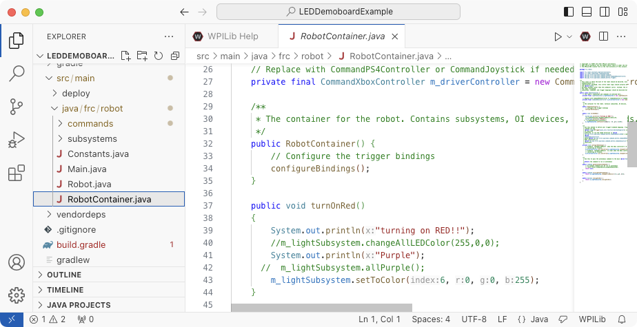

In this tutorial, we're going to send something to the "briefcase bot", which is a RoboRio (the brain our robots use), some peripherals and specifically, the strip of LED lights!

We can also use this same process to control the LEDs on the Demo Board.  Talk to a mentor regarding which "robot" you'll be using for this exercise.

## Step 1: Get The Code!

If you have not already done so, install Git on your PC:  https://git-scm.com/downloads

Visit the Repository where the code resides on GitHub https://github.com/Team-Voltage-386/Software-Projects-Beginner

You have several options for how to get the code on your PC. The concepts are the same. A copy of the code from GitHub will be put on your PC. For example, you can use the GitHub Desktop option which will prompt you for a location on your PC.

Here's how it can be done from within VS Code. 
Click the Code button and then Copy the URL

Open VS Code. 

Press Ctrl-Shift-P (or CMD-Shift-P on a Mac)

Paste in the URL you just copied.
It will ask you to choose a folder on your PC to put your local copy of the repo you are cloning.
Regardless of whether you use VS Code, GitHub Desktop or a downloaded Zip file to clone the repo, be aware of the following issue!
If you are using Windows, the "Public Documents" folder is a good choice.

Ask a mentor if you need help.

## Step 2: Open the project in VSCode!

In VSCode.

File -> Open Folder and navigate to the `LEDDemoBoardExample` folder within the `Software-Projects-Beginner-main` folder which you just cloned to your PC

Choose to trust the authors:

If prompted, choose to update the project with the current version of the extension:

Now navigate, using the filesystem explorer view on the left, to the source files:

## Step 3: Build The Project!

Open the Command Pallette (Ctrl-Shif-P or Cmd-Shif-P)  or Click the WPI icon.

Select the option "WPILIB: Build Robot Code"

Note - sometimes VS Code will automatically build the code when you open the folder

Hopefully you get this:

If not, ask a mentor for help.

## Step 4: Connect to the Briefcase Bot

Plug it in, give it a moment to broadcast its SSID, then associate your laptop:

Now use the WPILib menu to deploy robot code:

...TO BE CONTINUED!
